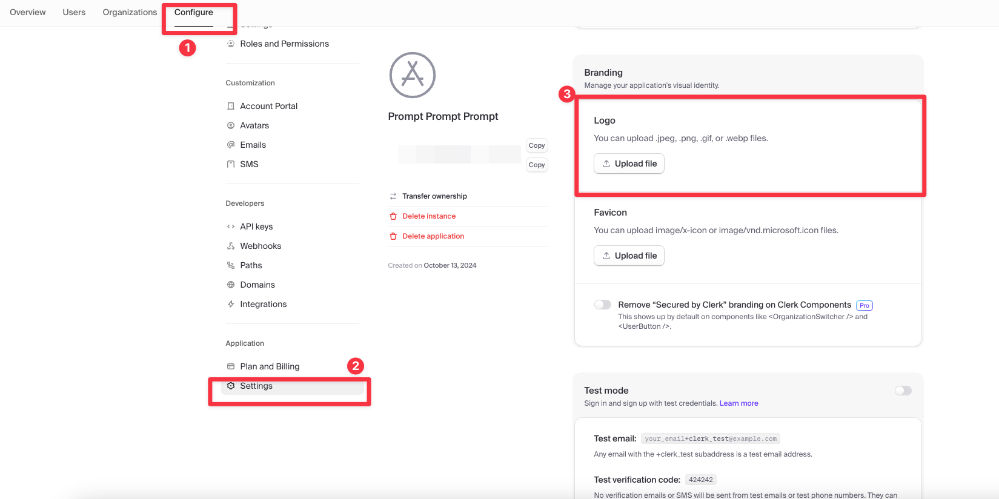

## Sentry

1. Go to sentry.io
2. Create a new project
3. Run the command like they give you (looks like this - npx @sentry/wizard@latest -i nextjs --saas --org adder-analytics-ltd --project red-panda). Options - yes for server - all default yes. Very simple wizard but give it time to run. Takes about 5-10 minutes to run. 
4. Add the token the wizard gives you to vercel

npx @sentry/wizard@latest -i nextjs --saas --org adder-analytics-ltd --project red-panda

## Clerk

1. Create new project and configure
2. Go to dashboard - https://dashboard.clerk.com/
3. Click "Development" at the top and click create production instance
4. Clone of development 
5. Primary domain option
6. Configure CNAME for frontend API 
7. Add CNAMes for account portal and e-mail 
8. Wait a little for it to set up SSL.
9. Add the new live keys to vercel.
10. Optionally add logo and favicon in Application settings 
11. Optionally update logo color in account portal link (or optionally use signout button)
12. Optionally follow directions to add google auth - https://clerk.com/docs/authentication/social-connections/google

# Fathom Analytics

1. Create new project on fathom - https://app.usefathom.com/sites
2. Update env variable with NEXT_PUBLIC_FATHOM_ID
3. Optionally track custom events (see below)

import { trackEvent } from 'fathom-client';
// In your component
const handleClick = () => {
  trackEvent('GOAL_ID', 0); // 0 is the value (optional)
};
Replace 'GOAL_ID' with the actual goal ID from your Fathom dashboard.

Vercel guide here - https://vercel.com/guides/deploying-nextjs-using-fathom-analytics-with-vercel